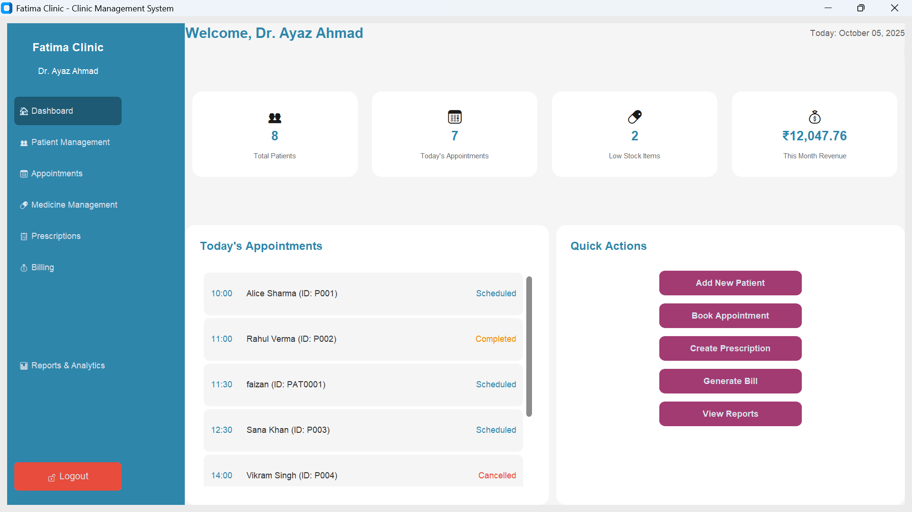
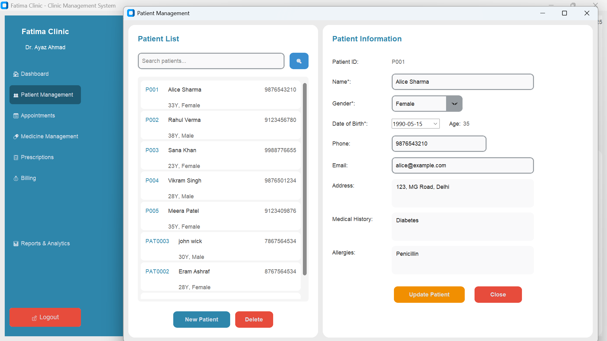
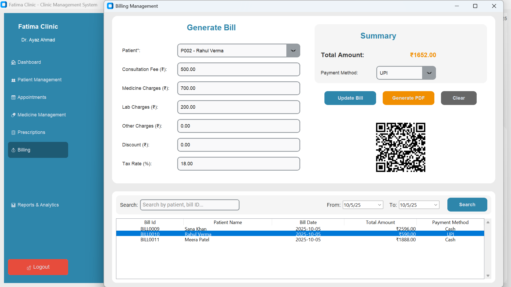
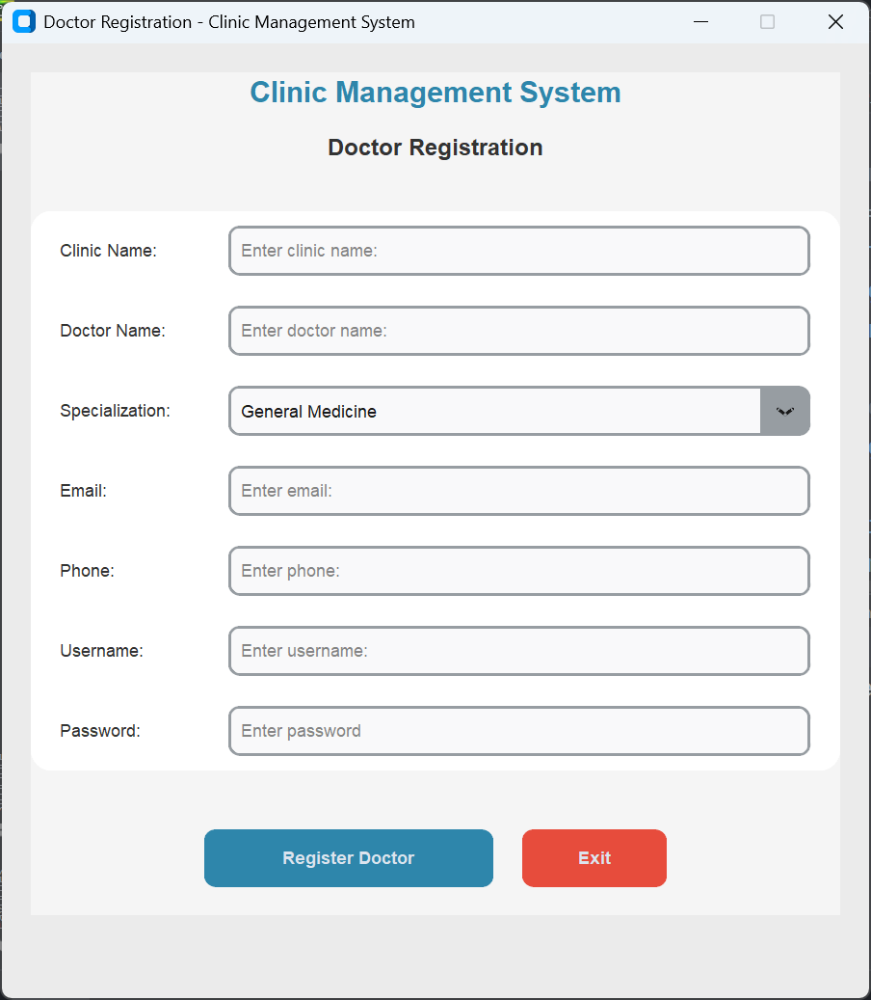

# Clinic Management System (Advanced)

A modular desktop clinic management application in Python — patients, doctors, appointments, medicines, prescriptions, billing and reporting on a MySQL backend.

## Overview

The system covers the workflow of a small clinic or doctor's office. Doctors register and sign in, then manage patient records, book appointments, record prescriptions, track medicine stock, and raise bills that can be printed as PDF invoices with a QR code.

The codebase is deliberately split into `database/`, `ui/` and `utils/` packages rather than a handful of large scripts, so each screen and data concern lives in its own module.

## Features

- Doctor registration and login with bcrypt-hashed passwords
- Patient records management
- Appointment scheduling with a date picker
- Medicine stock management
- Prescriptions with individual prescription items
- Billing with QR-coded PDF invoices
- Reports and analytics dashboard with charts

## Screenshots

**Clinic dashboard**



**Patient management**



**Billing and invoice**



**Doctor registration**



## Tech Stack

| Layer | Technologies |
| --- | --- |
| Language / GUI | Python 3.10+, Tkinter with CustomTkinter |
| Database | MySQL via PyMySQL |
| Reporting | ReportLab (PDF), Matplotlib (charts), qrcode (invoice QR codes) |
| Other | bcrypt (password hashing), tkcalendar (date picker), Pillow, cryptography |

## Project Structure

```
clinic-management-advanced/
├── main.py                      # Application entry point
├── config.py                    # Database and UI settings
├── database/
│   ├── db_manager.py            # Connections, table creation, password hashing
│   └── models.py                # Data access for doctors, patients, appointments...
├── ui/
│   ├── login_window.py
│   ├── main_dashboard.py
│   ├── doctor_registration.py
│   ├── patient_management.py
│   ├── appointment_management.py
│   ├── medicine_management.py
│   ├── prescription_management.py
│   ├── billing_management.py    # Billing, QR code and invoice
│   └── reports_analytics.py
├── utils/
│   ├── helpers.py
│   └── pdf_generator.py         # ReportLab PDF generation
├── screenshots/
├── requirements.txt
└── .env.example
```

## Installation

Requires **Python 3.10 or newer** and a running MySQL server.

```bash
python -m venv venv
venv\Scripts\activate          # Windows
pip install -r requirements.txt
```

## Configuration

Settings are defined in `config.py`:

| Setting | Default | Notes |
| --- | --- | --- |
| `DATABASE_CONFIG['host']` | `localhost` | MySQL host |
| `DATABASE_CONFIG['user']` | `root` | MySQL user |
| `DATABASE_CONFIG['password']` | `os.getenv('DB_PASSWORD', '1234')` | Reads the `DB_PASSWORD` environment variable, with a local development fallback |
| `DATABASE_CONFIG['database']` | `clinic_management` | Created automatically if it does not exist |

A root-level `.env.example` lists `DB_HOST`, `DB_USER`, `DB_PASSWORD` and `DB_NAME` as a reference. Only `DB_PASSWORD` is read from the environment at runtime; the other values are set in `config.py`.

## Database Setup

No separate step is required. On launch the application connects to MySQL, creates the `clinic_management` database if needed, and creates these tables if they do not exist: `doctors`, `patients`, `appointments`, `medicines`, `prescriptions`, `prescription_items`, `bills`.

Register your own doctor account through the app. Seed records only with fictional demo data.

## Running the Application

```bash
python main.py
```

## Demo Credentials

No real credentials or patient records are shipped. Create a doctor account through the registration screen on first run. Any demo data should be fictional (for example `John Doe`).

## Notes / Limitations

- Requires a local MySQL server; there is no bundled database.
- Desktop-only interface — there is no web or mobile client.
- Designed for a single clinic or office; it has not been load-tested for multi-user concurrency.
- Development was AI-assisted: requirements, database schema, UI direction, debugging, testing and integration were done by the author; AI tooling assisted with scaffolding and boilerplate.
- Development dates are approximate. The project was published to GitHub as a single initial commit rather than being developed in public.

## Future Improvements

- Appointment reminders by email or SMS.
- A web portal for patients to view their own records.
